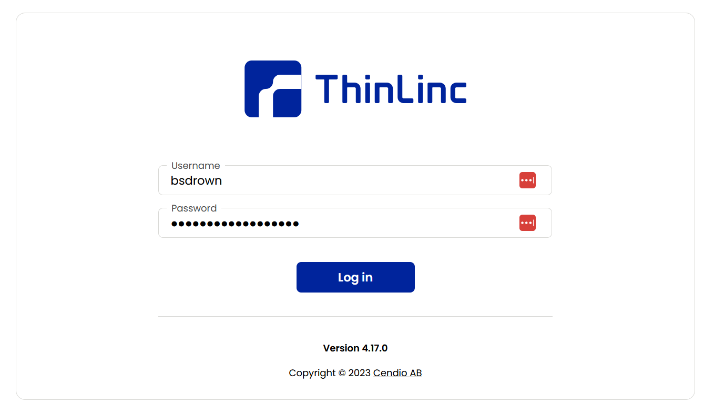
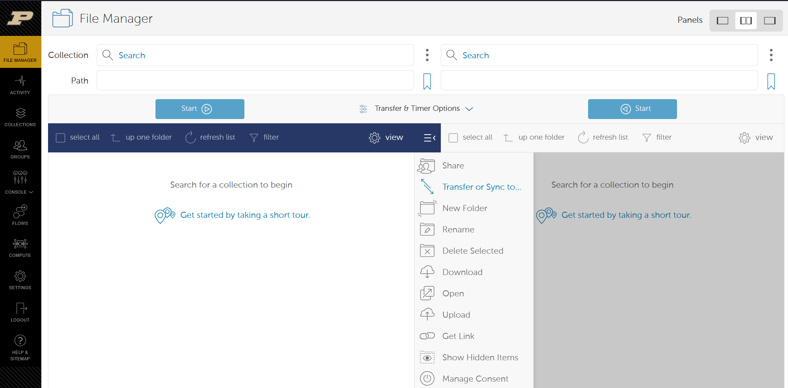
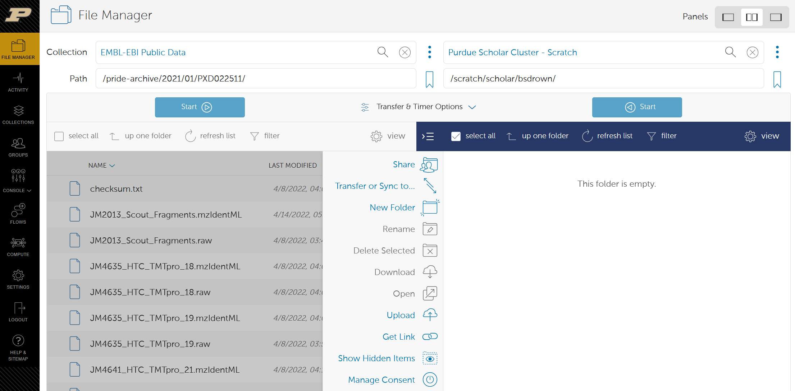
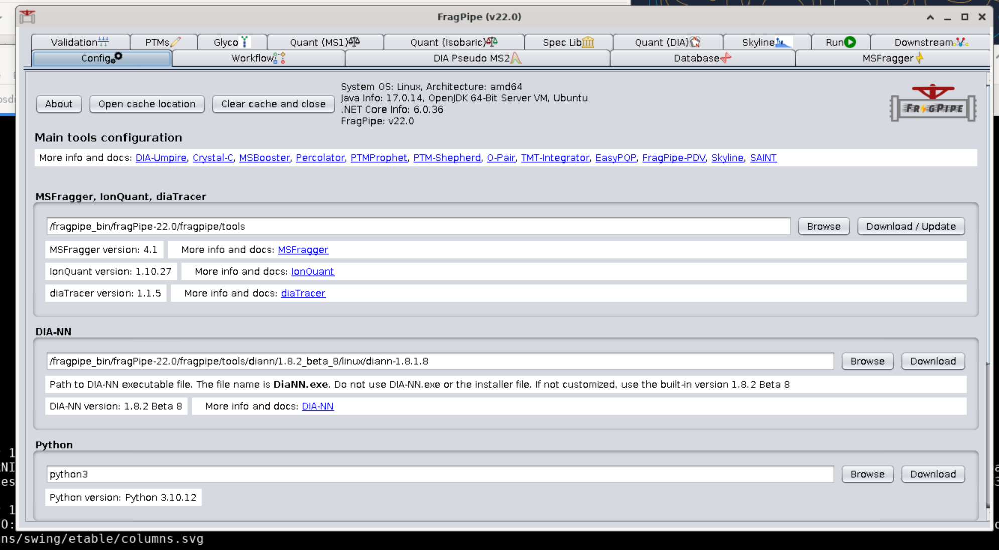
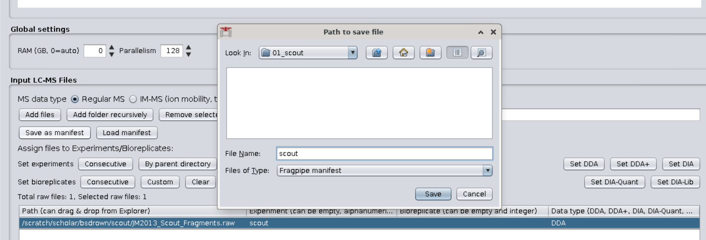
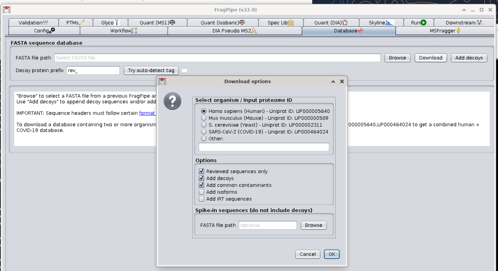

In this tutorial we will use MSFragger to search TMT-multiplex mass spectrometry data from Kuljanin, M. et al. Reimagining high-throughput profiling of reactive cysteines for cell-based screening of large electrophile libraries. *Nat. Biotechnol.* 39, 630–641 (2021).


# Table of Contents <!-- omit from toc -->

- [Accessing Scholar](#accessing-scholar)
  - [Prerequisites](#prerequisites)
  - [About compute clusters at Purdue](#about-compute-clusters-at-purdue)
  - [Accessing Scholar via ThinLinc](#accessing-scholar-via-thinlinc)
  - [Accessing Scholar via SSH](#accessing-scholar-via-ssh)
    - [MacOS, Linux, or Windows 11](#macos-linux-or-windows-11)
    - [Windows 10](#windows-10)
  - [Setting up environment on Scholar](#setting-up-environment-on-scholar)


# Accessing Scholar

## Prerequisites
This tutorial is designed to be possible with some limited familiarity with Unix environments. FragPipe and MSFragger can be installed locally on students' personal computers or run remotely.

## About compute clusters at Purdue
Scholar is a compute cluster that designed for use in classes like ours. It is configured in much the same ways as other community compute clusters maintained by RCAC at Purdue. Currently (Spring 2025) there are several clusters used for research:
 - Gautschi - Cluster built in 2024 that has a mix of CPU- and GPU-centric computation. Cluster access is possible by purchasing nodes.
 - Negishi - Cluster built in 2022 that is focused on CPU-only calculations. Cluster access is possible by purchasing nodes.
 - Gilbreth - Cluster that is focused on GPU-enabled applications like machine learning. Cluster access is possible by purchasing nodes.
 - Anvil - Massive cluster built for NSF-funded projects. Cluster use is controlled through [ACCESS](https://access-ci.org/).
More info about compute clusters at Purdue is available at [RCAC's website](https://www.rcac.purdue.edu/compute).

## Accessing Scholar via ThinLinc
If you want a desktop environment, point a web browser to `desktop.scholar.rcac.purdue.edu`. You will be prompted for a username and password. Note that because ThinLinc uses two-factor authentication, you will need to type your password followed by `,push`. With this desktop environment, you can run FragPipe in GUI mode which can be easier to setup your analysis.



## Accessing Scholar via SSH
If you just need to run programs via a command line interface, accessing Scholar via SSH makes sense. Again, your credentials for logging in are your netid and password followed by `,push`. More details about authentication is in on [RCAC's website](https://rcac.purdue.edu/knowledge/scholar/accounts/login/purdue_login). [Key-based authentication](https://rcac.purdue.edu/knowledge/scholar/accounts/login/sshkeys) is also possible if you are so inclined.

### MacOS, Linux, or Windows 11
Open the Terminal and run:
```sh
ssh USERNAME@scholar.rcac.purdue.edu
```

### Windows 10 
A SSH client will be needed like [PuTTY](https://www.putty.org/)

## Setting up environment on Scholar

If you haven't already cloned this repository, do so now.

```sh
git clone https://github.com/bdrown/chm696-abpp.git
```

The programs used in this tutorial and assignment are located on shared storage located at `/class/bsdrown/apps`. To make them more easily accessible, we can introduce a short script that runs whenever a terminal is openned. Connect to Scholar via ThinLinc and open the terminal.

# Download Data from PRIDE

Proteomics Identifications Database (PRIDE) Archive is a common place that proteomicists deposit their raw data along with their publications. PRIDE is a core member in the ProteomeXchange (PX) consortium, which provides a standardized way for submitting mass spectrometry-based proteomics data to public-domain repositories. Each entry has a unique PXD accession, contains some metadata about how data was collected, raw data, and often search results.

Check out the PRIDE entry associated with the paper from the Gygi lab [PXD022511](https://www.ebi.ac.uk/pride/archive/projects/PXD022511).

## Using Globus to Access Data

[Globus](https://www.globus.org/) is a highly efficient and robust method for transfering large datasets around the world. Purdue runs a Globus endpoint on Scholar, so we will use it to fetch data from PRIDE. Use an internet browser to access [`transfer.rcac.purdue.edu`](https://transfer.rcac.purdue.edu) using your Purdue credentials to login. You should see an [orthodox file manager](https://en.wikipedia.org/wiki/File_manager#Orthodox_file_managers) for transfering files between Globus endpoints.



We need to direct Globus to the appropriate endpoints. In the top-left textbox labeled `Collection` type `EMBL`. Select `EMBL-EBI Public Data` from the listed options. In the textbox labeled `Path` enter `/pride-archive/2021/01/PXD022511/` and type enter. You should see the list of files associated with this PRIDE entry.

In the top-right textbox type `Scholar`. Select `Purdue Scholar Cluster - Scratch` from the listed options. You may need to grant Globus permission to access this endpoint which you should do. The path should automatically fill with `/scratch/scholar/USERNAME`.



Select the right window, create a new folder named `scout`, and enter that folder by double clicking on it. Select right left window and check the box associated with the file `JM2013_Scout_Fragments.raw`. This raw file is associated with the data presented in Supplementary Figure 3. Click the `Start` button to initiate a file transfer from EMBL to Scholar's [scratch space](https://en.wikipedia.org/wiki/Scratch_space). The scratch space is large and highly performant, but is meant for temporary storage of files needed for computation. [RCAC will routinely delete old files in scratch spaces](https://www.rcac.purdue.edu/storage/scratch) to make room. We'll have time to complete our analysis but don't count on files still being there a few months from now!

You will receive an email once the Globus transfer is complete. Let's access Scholar to view the new files:

```bash
> ssh bsdrown@scholar.rcac.purdue.edu

************************************************************

***** Use of Purdue BoilerKey or SSH keys is Required ******

************************************************************

(bsdrown@scholar.rcac.purdue.edu) Password:
Last login: Tue Jan 14 14:42:41 2025 from bryon-desk.science.purdue.edu
bsdrown@scholar-fe05:[~] $ ls /scratch/scholar/bsdrown/scout
JM2013_Scout_Fragments.raw
```

Running the `ls` command let's us list the contents of a particular directory. We see the file that we fetched from PRIDE.

There are a few environmental variables set by default on RCAC systems, including your scratch location on a given compute cluster. `$SCRATCH` is a useful shortcut since the user and system can vary.

```bash
bsdrown@scholar-fe05:[~] $ echo $SCRATCH
/scratch/scholar/bsdrown
bsdrown@scholar-fe05:[~] $ ls $SCRATCH/scout
JM2013_Scout_Fragments.raw
```

Let's take a look at what's in this file using the `head` command - lists the first ten lines of the file.

```bash
bsdrown@scholar-fe05:[~] $ head -n 5 $SCRATCH/scout/JM2013_Scout_Fragments.raw
�FinnigaB���,�Xcalibur_SystemOrbitrap_Lumos=�8l���,�Xcalibur_SystemXcalibur_System@k_26062019_Fragments_100ug.C:\Xcalibur\methods\Miljan\210min_Orbiter.meth"C:\Xcalibur\Data\active\JM2013.rawC:\Xcalibur\Data\activeA1����������������     6x8 vials|��|�&StudyClient
MANCIAS-LUMOS�FinniganBl���,�Xcalibur_SystemXcalibur_Systeml���,�Xcalibur_SystemXcalibur_System�PC:\Xcalibur\Data\active\210min_Orbiter_6905589f-a190-46ca-a663-641a4e34341a.methThermo EASY-nLCProxeon_EASY-nLCOrbitrap Fusion Lumos
                                                                                                TNG-Calcium��ࡱ␦�>��     ��������������������������������������������������������������������������������������������������������������������������������������������������������������������������������������������������������������������������������������������������������������������������������������������������������������������������������������������������������������������������������������������������������������������������������������������������������

����␦

     123456789:;<=>?@ABC����EFGHIJKLMR����PQ��������������������������������������������������������������������������������������������������������������������������������������������������������������������������������������������Root Entry��������   ��X>,��Proxeon_EASY-nLC"��������@O�X>,��՛X>,�Text
���������Data
������������[
```

While there are some parts that are human-readable (e.g. seems to have been acquired on a Orbitrap Fusion Lumos), many characters cannot be interpreted. The RAW file format is proprietary, so we will need to use software that utilizes libraries provided by Thermo Fisher to access these data.

# Setup MSFragger search

## Run FragPipe GUI

Login to the desktop interface of Scholar and open a terminal. Start FragPipe by running the following:

```bash
apptainer run /class/bsdrown/apps/fragpipe_22.0.sif
```

This will use Apptainer to create a container of the image `fragpipe_22.0.sif` and run the fragpipe graphical user interface. This image was [initially created with Docker](https://github.com/bdrown/dockerfiles/blob/main/fragpipe/Dockerfile), but RCAC prefers use of Apptainer on their systems due to security concerns.

You should see a few error related to FragPipe attempting to write to cache when Apptainer uses read-only filesystems. You can ignore these errors, and FragPipe should launch:



We will now need a few things to run a search, so we will address them one by one:
1. File manifest that lists all of the raw files to be analyzed and associate them with experiments
2. Database of protein sequences and decoys
3. Workflow file that defines how to conduct the analysis and which database to reference
4. Script to send to out workload manager

## Create File Manifest

Click on the `Workflow` tab of MSFragger. Halfway down, you will see "Input LC-MS Files". Select `Add files` and navigate to the location that you saved the `.raw` file. You can optionally give this raw file's experiment a name (e.g. "scout") and then click `Save as manifest`. 



If we inspect this file, we can see that it is very simple; it just contains the data that we see in table on the Workflow tab. For very large datasets, it is often more convenient to directly create this text file than create it with FragPipe.

```bash
bsdrown@scholar-fe04:[~] $ cat ~/chm696-abpp/01_scout/scout.fp-manifest
/scratch/scholar/bsdrown/scout/JM2013_Scout_Fragments.raw       scout           DDAbsdrown@scholar-fe04:[~] $
```

## Download Database

We need a list of protein sequences in [FASTA file format](https://en.wikipedia.org/wiki/FASTA_format) that we expect may have been present in the samples associated with this mass spectrometry acquisition. To estimate false discovery rate, we will want the database to include "decoy" proteins - sequences that do not correspond to real proteins. One common way to generate decoy sequences with similar physiochemical properties to real proteins is to simply reverse sequences. FragPipe provide a convenient way to download commomly studies proteomes and generate decoys. Click on the `Database` tab, select `Download`, choose the appropraite organism (Homo sapiens in this case), and click `OK`. Save the database to your home directory.



Alternatively, you can use the database located at `/class/bsdrown/data/databases/2025-03-09-decoys-reviewed-contam-UP000005640.fas`.

